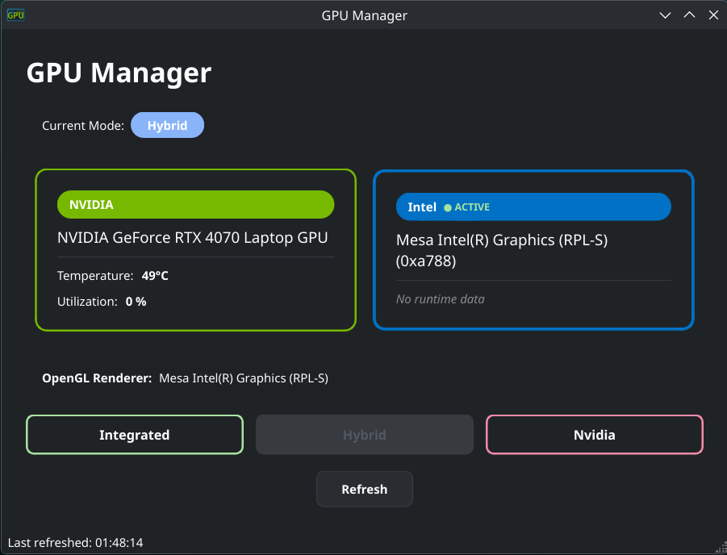

# envycontrol-gpu-manager

Linux desktop GUI that shows your active and inactive GPUs at a glance, and lets you switch between them via **envycontrol** — with a single click.

Built with Python + PySide6 (Qt6). Works on KDE Plasma, GNOME, and any Linux desktop.

## Features

- Shows **ALL GPUs** (Intel, NVIDIA, AMD) — even when powered off by envycontrol
- **Color-coded cards**: green border = active GPU, dim gray = powered off
- **Temperature & utilization** from `nvidia-smi`
- **Current envycontrol mode** badge (integrated / hybrid / nvidia)
- **One-click GPU switching** with `pkexec` (polkit graphical prompt)
- **Standalone binary** (86 MB, self-contained) — no Python or Qt required to run

## Screenshot



## Requirements

- **Linux** (tested on Arch Linux with KDE Plasma)
- **envycontrol** — installed and configured for GPU switching
- **nvidia-smi** — optional, for NVIDIA temperature and utilization
- **pkexec / polkit** — for privileged GPU switching (pre-installed on most distros)
- **glxinfo** (`mesa-utils`) — for OpenGL renderer detection

## Installation

### Option 1: Pre-built binary (recommended)

Download the latest release from the [Releases page](https://github.com/anomalyco/envycontrol-gpu-manager/releases).

```bash
# Download and make executable
wget https://github.com/anomalyco/envycontrol-gpu-manager/releases/latest/download/gpu-manager
chmod +x gpu-manager

# Run directly
./gpu-manager

# Or install to PATH
mkdir -p ~/.local/bin
cp gpu-manager ~/.local/bin/
```

### Option 2: Build from source

```bash
# Clone the repository
git clone https://github.com/anomalyco/envycontrol-gpu-manager.git
cd envycontrol-gpu-manager

# Create virtual environment and install dependencies
python3 -m venv venv
./venv/bin/pip install -r requirements.txt

# Run the app
./venv/bin/python main.py
```

### Option 3: Build standalone binary

```bash
pip install pyinstaller
pyinstaller --onefile --name "gpu-manager" --hidden-import "PySide6.QtCore" --hidden-import "PySide6.QtGui" --hidden-import "PySide6.QtWidgets" main.py
# Binary is at: dist/gpu-manager
```

## Usage

Run from terminal:

```bash
gpu-manager
```

Or launch from your application menu (see "Desktop Entry" below).

### Switching GPUs

1. Click **Integrated**, **Hybrid**, or **Nvidia** button
2. `pkexec` will prompt for your password (polkit graphical dialog)
3. After switching, **log out and log back in** (or reboot) for changes to take effect
4. A confirmation dialog will remind you

### Refresh

Click the **Refresh** button or re-launch the app to see updated GPU state, temperatures, and mode.

## Desktop Entry (Application Menu)

To see GPU Manager in your application launcher:

```bash
# Install the binary first
cp dist/gpu-manager ~/.local/bin/

# Create directories
mkdir -p ~/.local/share/applications
mkdir -p ~/.local/share/icons/hicolor/scalable/apps

# Copy desktop entry and icon
cp gpu-manager.desktop ~/.local/share/applications/
cp gpu-manager.svg ~/.local/share/icons/hicolor/scalable/apps/

# Refresh the desktop database (KDE)
kbuildsycoca6

# For other desktops, use:
# update-desktop-database ~/.local/share/applications/
```

Now find "GPU Manager" in your application menu.

## Building from Source (full build script)

```bash
cd envycontrol-gpu-manager

# Install dependencies
python3 -m venv venv
./venv/bin/pip install -r requirements.txt pyinstaller

# Build standalone binary
./venv/bin/pyinstaller --onefile --name "gpu-manager" --hidden-import "PySide6.QtCore" --hidden-import "PySide6.QtGui" --hidden-import "PySide6.QtWidgets" main.py

# Output: dist/gpu-manager
# Binary size: ~86 MB (self-contained, includes Qt6 and Python)
```

Or use the provided build script:

```bash
./build.sh
```

## Uninstall

```bash
rm -f ~/.local/bin/gpu-manager
rm -f ~/.local/share/applications/gpu-manager.desktop
rm -f ~/.local/share/icons/hicolor/scalable/apps/gpu-manager.svg
kbuildsycoca6  # Refresh menu
```

To remove the source:

```bash
rm -rf ~/gpu-manager  # Or wherever you cloned it
```

## How It Works

### GPU Detection

The app discovers GPUs through multiple sources:

1. **DRM subsystem** (`/sys/class/drm/cardN`) — finds active GPUs driving displays
2. **nvidia-smi** — detects NVIDIA GPUs even when not in DRM (driver loaded)
3. **modinfo nvidia** — detects NVIDIA driver existence as fallback
4. **PCI bus** (`/sys/bus/pci/devices`) — finds Intel and AMD GPUs via class code

Each GPU is marked as **active** or **offline** and displayed accordingly.

### GPU Switching

The app calls `envycontrol --switch MODE` via `pkexec` to gain root privileges. When switching to NVIDIA mode, it auto-detects the display manager (SDDM, GDM, LightDM) and passes the `--dm` flag.

## License

GNU General Public License v3.0 — see [LICENSE](LICENSE).

## Contributing

Contributions welcome! Open an issue or pull request on GitHub.
